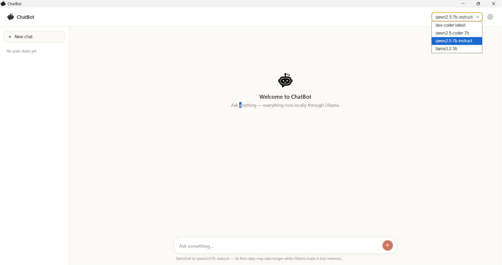
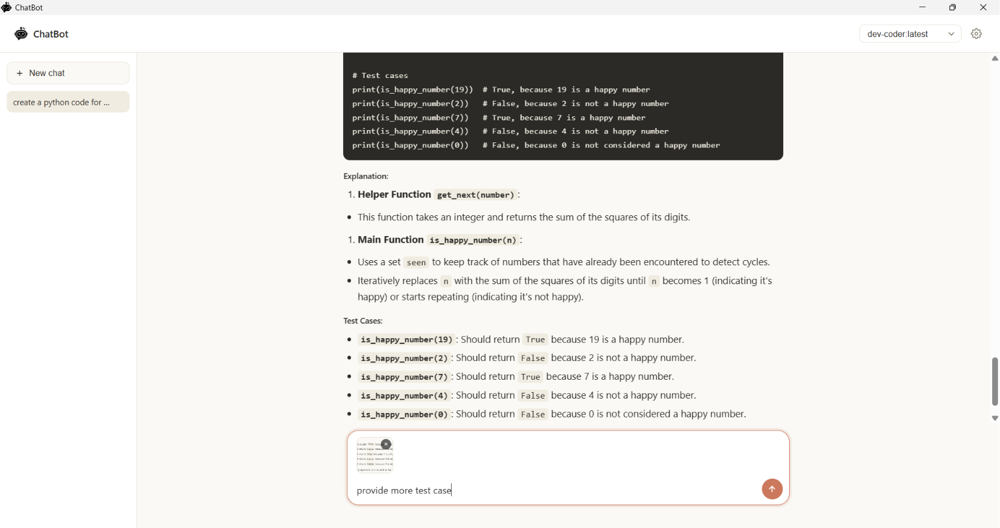
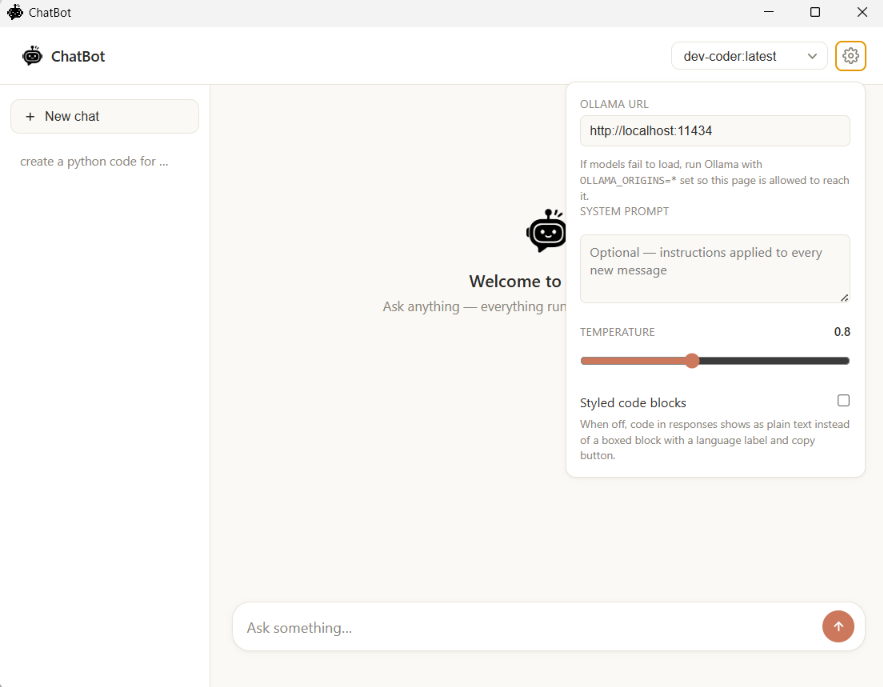

# ChatBot

A lightweight Windows desktop chat interface for Ollama.

ChatBot provides a simple and modern way to interact with locally hosted AI models. Built with Electron, it connects directly to your local Ollama server so you can chat privately on your own hardware without relying on cloud services.

Unlike many Ollama frontends, ChatBot focuses on simplicity. It automatically manages the Ollama server for you, so after installing Ollama and downloading a model, you can simply launch ChatBot and start chatting.

---

## Why ChatBot?

Many Ollama interfaces are designed for advanced users and include a wide range of features and configuration options.

ChatBot takes a different approach. It focuses on providing a clean, lightweight desktop experience with minimal setup, allowing you to start chatting with your local AI models in just a few minutes.

---

## Screenshots

### Main Chat Interface



### Chat Conversation



### Settings



## Features

- Local AI chat powered by Ollama
- Automatically starts and stops the Ollama server
- Automatic detection of installed models
- Persistent conversation history
- Streaming responses
- Markdown-formatted responses
- Syntax-highlighted code blocks with one-click copy
- Copy any assistant response
- Stop generation while a response is streaming
- Custom system prompt
- Adjustable temperature
- Vision model support
- Drag-and-drop image uploads
- Clipboard image pasting
- Configurable Ollama endpoint
- Lightweight desktop interface
- No cloud dependency — everything runs locally

---

## Requirements

- Windows 10 or later
- Ollama installed
- At least one downloaded model

Download Ollama:

https://ollama.com/

You do **not** need to run `ollama serve` manually.

When ChatBot launches, it automatically:

1. Checks whether Ollama is installed.
2. Detects whether the Ollama server is already running.
3. Starts the server if necessary.
4. Waits until it's ready while displaying live status updates.

If ChatBot started the server, it shuts it down when the application closes. If Ollama was already running before ChatBot launched, it leaves it running.

Download a model:

```bash
ollama pull llama3.2
```

For image understanding:

```bash
ollama pull llava
```

---

## Installation

### Run from Source

Install Node.js:

https://nodejs.org/

Clone the repository:

```bash
git clone https://github.com/NicoleBenlot/ChatBot.git
cd ChatBot
```

Install dependencies:

```bash
npm install
```

Run the application:

```bash
npm start
```

---

## Building

Build the application:

```bash
npm run build
```

The generated files will appear in:

```text
dist/
```

Depending on your build configuration, this may include:

- Windows installer (`Setup.exe`)
- Portable executable (`.exe`)

---

## Project Structure

```text
ChatBot/
│
├── chatbot.html
├── chatbot.css
├── chatbot.js
├── loading.js
│
├── main.js
├── preload.js
├── package.json
│
└── dist/
```

---

## Configuration

By default, ChatBot connects to:

```text
http://localhost:11434
```

The endpoint can be changed from **Settings** if you want to connect to a different Ollama server.

---

## Troubleshooting

### Stuck on the loading screen

ChatBot displays exactly what it's doing while starting Ollama. If an error occurs, a **Retry** button will appear.

Common causes include:

- Ollama isn't installed.
- The `ollama` command isn't available in your system PATH.
- Another application is already using port `11434`.

Check installed models:

```bash
ollama list
```

### No models appear

Install a model:

```bash
ollama pull llama3.2
```

Restart ChatBot if necessary.

### Connection errors

Verify that Ollama is responding:

```bash
curl http://localhost:11434/api/tags
```

If the request fails while ChatBot is running, verify your Ollama configuration or the endpoint configured in ChatBot.

---

## Documentation

See **USER_GUIDE.md** for:

- Installation walkthrough
- Recommended models
- Usage guide
- Troubleshooting
- Hardware recommendations

---

## License

This project is licensed under the MIT License.
